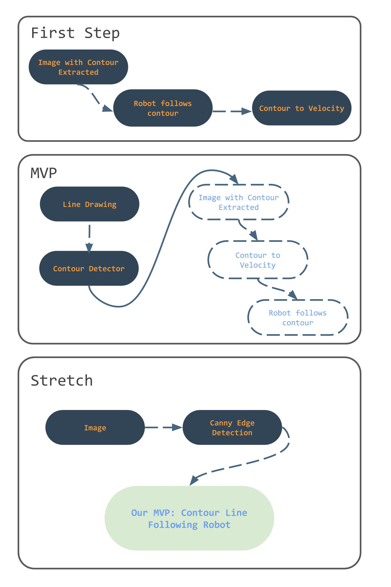

# Project Proposal

#### CompRobo: Computer Vision Project
#### Anna Griffin and Sherrie Shen

 

## What is the main idea of your project?
We plan to use computer vision to take a line drawing and turn it into velocity commands for the robot to draw out(drive) on the floor. To process the image, we will use contour detection to generate a line drawing which will serve as a skeleton for the path on which we want our robot to drive. With the noise reduced as much as possible we intend on translating the contour data into a set of directions to publish for the Neato. Ideally the robot will set out markers as it traverses through the drawing so that we can visualize its path to measure how accurately it was able to replicate the original image. If time permits, as a stretch goal, we had been thinking about doing edge detection so that we can use photographed image which have another level of complexity to them.

## MVP and stretch goal?
We have outlined our idea in the diagram below. 

Our MVP is to implement a contour detector on an image where the edges and lines are already extracted by an edge detector from a third party library or a line drawing and then convert the contour generated by our contour detector into velocity commands to make the robot drive in the shape of the contour. 

Our stretch goal is to implement the Canny Edge detector ourselves as well so that we can use more sophisticated images and achieve the full pipeline of image to robot drawing. 

## What are your learning goals for this project?
One goal of ours is to implement a a working contour detection algorithm that utilizes the output of an edge detector. We 
have both used contour detection in some capacity before, however we have relied on the OpenCV library and this will be our 
first time implementing an algorithm from scratch. We also would like to use this project as an opportunity to practice iterative development. We 
have carefully planned out a set of milestones that build upon each other. Using this approach, we can enhance each iteration 
by adding a new capabilities to an already working version. This project has many different steps which makes it a very 
fitting approach. 

## What algorithms or computer vision areas will you be exploring?
We will be working in the image processing/segmentation space and leveraging contour detection algorithms. We also might look into Canny
Edge detection algorithms as a stretch goal or extension of this project. 

## What components of the algorithm will you implement yourself, which will you use built-in code for? Why?
Ideally, we will be able to implement a contour As a first step, wetection algorithm completely from scratch. We are both interested in this
aspect of the project so we want to challenge ourselves and make it a goal to implement it ourselves. We will utilize a third party library like 
OpenCV to do Canny Edge Detection to perform preprocessing on the image before feeding it to our contour detector. We decided to implement contour detector on a line drawing or a preprocess image with edges only instead of on a raw image because cascading an edge detector with our contour detector can achieve better accuracy and allows us to reach our goal in incremental steps. Computational cost wise, our contour detector will be faster as well as it will specialize in detecting contour from edges.

If we wanted to expand the complexity of the input images to accommodate and time allows, we will implement a Canny Edge Detector from scratch as an interesting extension. 

## What do you view as the biggest risks to you being successful (where success means achieving your learning goals) on this project?
One risk we forsee would be converting the contour we extracted from an image to velocity commands to drive the Robot. Both of us are rusty on differential drives and need to refresh our knowledge on how to have robot follow a predetermined shape. We will inevitably spend some time tuning relevant parameters.

Another risk is to find digestible papers or resources for a contour detection algorithm to implement as there are some terminologies we are not familiar with.

## What might you need from the teaching team for you to be successful on this project?
* The QEA assignment on bridge of death or maybe a quick crash course on have robot followed a predetermined shape. Or should we use the tf module with the robot odometry to periodically compute and check how far the robot has moved?
* What is texton gradient or texton map?
* What is the "CIE 1976 (L*, a*, b*) color space (CIELAB)"?

## Resources
* [Edge based image contour detection](https://www.microsoft.com/en-us/research/wp-content/uploads/2013/01/12-2013-icme-edge.pdf): A paper that proposes an edge-based contour detection algorithm to improve the efficiency while maintaining the accuracy of traditional contour based algorithm.
* [The Berkeley Segmentation Dataset and Benchmark](https://www2.eecs.berkeley.edu/Research/Projects/CS/vision/bsds/): Dataset with images and their edge and contour segmentation.
* [Contour Detection and Image Segmentation](https://ttic.uchicago.edu/~mmaire/papers/pdf/mmaire_thesis.pdf): This is a more in depth and long thesis on contour detection and image segmentation. We might not utilizes the specific algorithm introduced in this thesis but the context and mathematical terminology introduced are useful.
